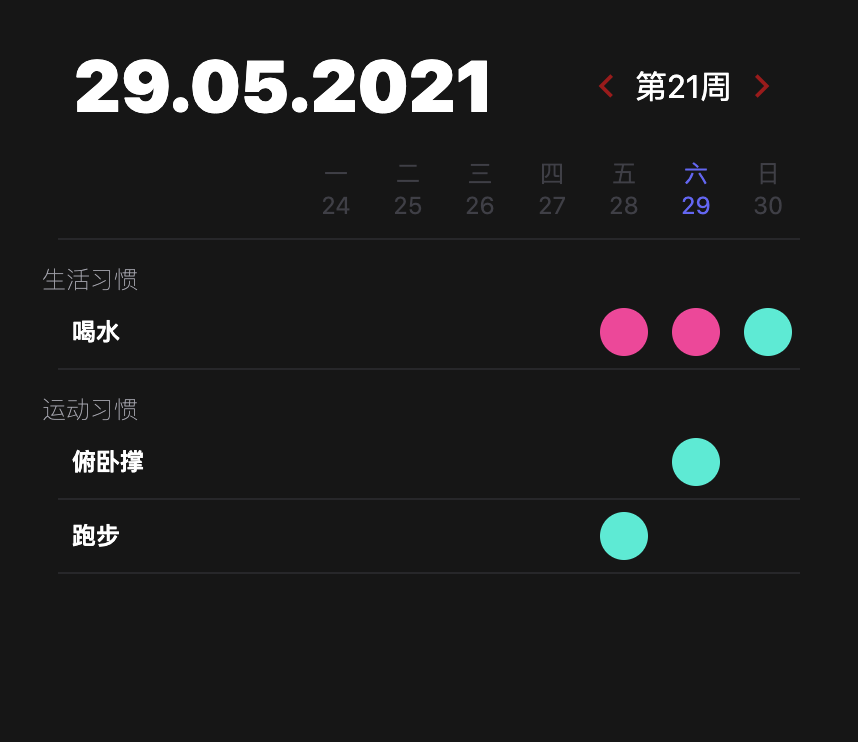

<h1 align="center">
   
  Loop Habit
   
</h1>
<h4 align="center">Track your habit goal in your menu bar</h4>

Inspired by [iSoron/uhabits](https://github.com/iSoron/uhabits) and [NerdyPepper/dijo](https://github.com/NerdyPepper/dijo), Loop Habit is a desktop menubar app that helps you 
create and maintain good habits, allowing you to achieve your long-term goals. 
It is completely ad-free and open source.

# ScreenShot
 
                                                                

# Install
Download the latest release and run the app or

- clone repo
- yarn
- yarn electron:serve

# Credits
Use [muc-dev/linked](https://github.com/muc-dev/linked) as an electron template
